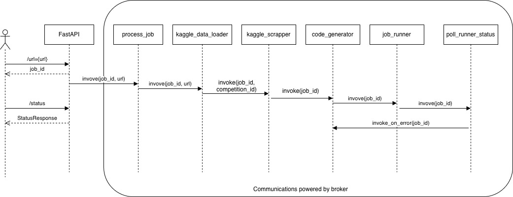

# Kaggle Competition Solver

This project provides a robust, scalable system to automatically generate a `submission.csv` file for a Kaggle competition given its URL. The system is designed to be fully autonomous after the initial request.

## 1. Problem Overview

The goal is to create a system with a single entrypoint that accepts a Kaggle competition URL. This triggers a complete, unattended pipeline that:
1.  Analyzes the competition.
2.  Generates model and training code using an LLM.
3.  Executes the code in a sandboxed environment.
4.  Produces a `submission.csv` file.

A key requirement is that the system must handle high concurrency, supporting up to 50 simultaneous requests without failure.

## 2. Final Architecture: REST API + Queue-Based System

I chose a distributed, asynchronous architecture composed of a non-blocking REST API, a message queue, and independent worker processes. This design is inherently scalable, resilient, and well-suited for long-running, resource-intensive tasks.



### Components

1.  **Web Server (FastAPI):**
    *   A lightweight, high-performance ASGI web framework.
    *   Provides a single non-blocking endpoint: `/run?url=<kaggle_url>`.
    *   **Responsibilities:**
        *   Validates the incoming request.
        *   Generates a unique `job_id`.
        *   Creates a job metadata JSON object.
        *   Enqueues the job.
        *   Immediately returns the `job_id` to the client, allowing the client to poll for results.
        *   Provides another endpoint `/status/<job_id>` for polling.

2.  **Job Queue (Redis & Taskiq):**
    *   Redis is used as the message broker and result backend because of the low latency and light weight nature.
    *   Taskiq is used for creating and managing tasks as it supports async by default.
    *   **Responsibilities:**
        *   Acts as a buffer between the web server and the workers, decoupling the two services.
        *   A List holds the queue of `job_id`s waiting to be processed.
        *   A Hash stores the job metadata JSON for each `job_id`, allowing for status tracking.

3.  **Workers (Taskiq Worker):**
    *   Separate processes that runs the core logic. It can be scaled horizontally to handle more jobs.
    *   **Responsibilities:**
        *   Executes tasks in a directed graph (DG) based on the following flow:
            *   `fast-api`: Initiates the job and adds it to the queue.
            *   `process_job_queue`: Orchestrates the execution of subsequent tasks.
            *   `kaggle_data_loader`: Fetches competition data.
            *   `kaggle_scraper`: Scrapes competition instructions.
            *   `code_generator`: Generates Python code using an LLM.
            *   `job_runner`: Executes the generated code in a sandboxed environment (Docker).
            *   `poll_runner_status`: Monitors the execution status and handles submission or retries.

4.  **Code Execution Environment (Docker):**
    *   Provides a sandboxed environment for running the LLM-generated code.
    *   **Responsibilities:**
        *   Isolates the execution from the host system, preventing security risks.
        *   Manages dependencies by installing the required libraries specified by the LLM or a standard set of data science libraries.
        *   Ensures that the execution environment is clean and reproducible for every job.

### API Response Structure
A **status API** was introduced because this task involves long-running jobs, and keeping an HTTP connection open for the entire duration would unnecessarily consume compute resources. Since the requirement was to trigger the process with a single command, a simple `user_run.py` script was created to handle the complete execution flow. This script could also be implemented as a shell script if preferred.

The `/status/{job_id}` endpoint returns a consistent JSON object defined by the `StatusResponse` Pydantic model in `app/schemas/status.py`:

```python
class StatusResponse(BaseModel):
    status: str
    source: Optional[str] = None
    path: Optional[str] = None
    message: Optional[str] = None
```

*   **status:** The current status of the job (`pending`, `processing`, `completed`, `failed`).
*   **source:** The storage location of the submission file (`local` or `s3`).
*   **path:** The path to the submission file.
*   **message:** A message providing more information about the job's status.

### Why This Architecture Was Chosen

*   **Pros:**
    *   **High Scalability:** The number of workers can be increased or decreased based on the queue size, allowing the system to handle a high volume of requests.
    *   **Resilience & Fault Tolerance:** The retry logic handles transient errors in the generated code.
    *   **Asynchronous & Non-Blocking:** The API remains responsive to new requests, even when many jobs are being processed. Users get an immediate response and can check the status later.
    *   **Decoupling:** The API, queue, and workers are independent services. They can be developed, deployed, and scaled separately.
    *   **Security:** Running untrusted, LLM-generated code directly on a server is a major security risk. Docker containers provide a strong isolation boundary.

*   **Cons:**
    *   **Increased Complexity:** This architecture has more moving parts than a monolithic application, requiring more effort to set up and maintain (e.g., managing Redis, Docker, and multiple processes).
    *   **Requires a Message Broker:** A dependency on a service like Redis is introduced.

## 3. Alternative Architectures Considered

### a) Monolithic, Synchronous API

*   **Description:** A single web server (e.g., Flask or FastAPI) where the `/run` endpoint performs all the work in a single, blocking request-response cycle. The HTTP connection would be held open until the `submission.csv` is generated.
*   **Pros:**
    *   Simple to design and implement for a single-user, non-concurrent scenario.
*   **Cons:**
    *   **No Concurrency:** Can only process one request at a time. 50 concurrent users would overwhelm the server, and most requests would fail.
    *   **HTTP Timeouts:** Kaggle model training can take minutes or hours. This far exceeds standard HTTP timeout limits (e.g., 30-120 seconds), making this approach non-viable.
    *   **No Resilience:** If the script fails for any reason mid-process, the entire job is lost and the user receives an error with no chance for a retry.

---

### b) LangChain-based Architecture

*   **Description:** Use LangChain as an orchestration layer for handling task dependencies and managing asynchronous execution across multiple components.  
*   **Pros:**
    *   Provides high-level abstractions for chaining tasks and managing context.
    *   Popular within the LLM ecosystem, with integrations for various data sources and tools.  
*   **Cons:**
    *   **Over-abstracted:** The high level of abstraction limits control and transparency over execution flow, which is critical for debugging and fine-grained scheduling.  
    *   **Unreliable Async Support:** Asynchronous task execution is poorly supported. The official async utilities have been deprecated. The documentation for the new version (v1.0, released only two weeks ago) is limited. The general feedback from the community is that documentation is inconsistent.  
    *   **Overkill for the Use Case:** The system’s primary need is efficient async task orchestration, not complex agent or LLM chaining. Hence, LangChain introduces unnecessary complexity and dependency overhead.

---
### c) Celery and Other Python Queue Frameworks

*   **Description:** Use task queue frameworks like **Celery** and **Dramatiq** for background task execution.  
*   **Pros:**
    *   Mature ecosystems with robust retry and monitoring support.
    *   Suitable for CPU-bound tasks or synchronous job execution.  
*   **Cons:**
    *   **Blocking Worker Model:** Celery workers execute tasks synchronously. To achieve async behavior, each task must spawn its own event loop, which negates the efficiency benefits of async I/O.  
    *   **Inefficient for High I/O Tasks:** These frameworks are better suited for parallel CPU tasks, not long-lived, high I/O async workloads.

### d) Message Brokers (Kafka, RabbitMQ)

*   **Description:** Use a dedicated message broker to manage job queues and distribute workloads.  
*   **Pros:**
    *   Reliable and battle-tested systems for message passing and event-driven architectures.
    *   Strong delivery guarantees and fault tolerance.  
*   **Cons:**
    *   **Operational Overhead:** Requires additional infrastructure and configuration (topics, exchanges, consumer groups, etc.) that are unnecessary for this relatively simple workflow.
    *   **Overkill for Prototype Scale:** Adds latency and deployment complexity that do not align with the project’s immediate needs.

---

## 4. Future Work and Production Considerations

1. **Extending the LLM Agent/Runner:**  
   The current LLM agent is used solely for generating code. In production, it should also infer additional metadata such as required dependencies, container CPU and memory limits, and other resource constraints. The current implementation supports only a limited set of libraries.

2. **Data Storage and Caching:**  
   At present, the local file system is used to store data and instruction files, serving both as cache and intermediate storage as sending large payloads through the task queue is inefficient. A distributed storage solution such as **Amazon S3** or a **Distributed File System** should be adopted. Regular cleanup policies should also be implemented to manage stale data.

3. **Scalability and Workflow Orchestration:**  
   If the system’s complexity increases, frameworks like **LangChain** may need to be re-evaluated for more advanced orchestration or dynamic task composition.

4. **Persistence and State Management:**  
   **Redis** is currently used as the broker and temporary store. For reliable persistence, a more durable backend such as **MongoDB** or another persistent datastore should be introduced. Automatic cleanup jobs should be configured to remove outdated keys and logs.

5. **Compute Environment Flexibility:**  
   The current implementation runs workloads inside **Docker containers**, but it is designed to support any external compute service that can accept jobs and provide status updates. This plug-and-play design allows easy migration to **cloud compute platforms** (such as AWS Batch, Google Cloud Run, or Azure Container Instances) with minimal code changes.

6. **Minor Codebase Cleanup:**  
   A few small refactoring tasks remain to streamline the codebase, mainly to remove minor redundancies in the code and file handling.


## 5. Setup & Usage

1.  **Prerequisites:**
    *   Python 3.9+
    *   Docker
    *   Redis

2.  **Installation:**
    ```bash
    pip install -r requirements.txt
    ```

3.  **Run Services:**
    *   **Start Redis:**
        ```bash
        redis-server
        ```
    *   **Start Worker(s):**
        ```bash
        taskiq worker app.workers.main:broker
        ```
    *   **Start API Server:**
        ```bash
        uvicorn app.main:app --host 0.0.0.0 --port 8000
        ```

4.  **Run:**
    *   s:
        ```bash
        python user_run.py <url>
        ```
